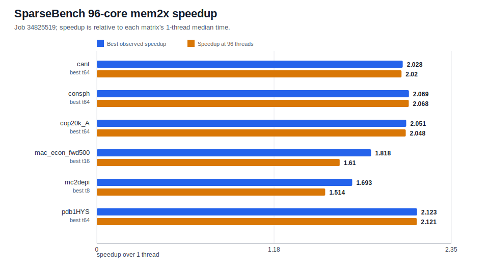
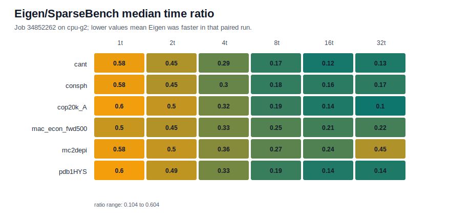
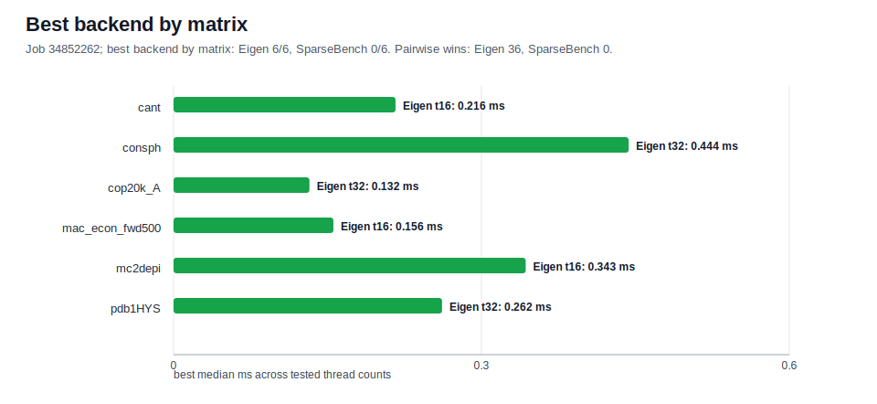

# Building a Reproducible Sparse Matrix Benchmark on Hyak

SparseBench++ started as a correctness-first sparse matrix benchmark harness. The first useful goal was modest: take a C++ CSR SpMV implementation from tiny checked-in fixtures to real SuiteSparse inputs on Hyak, without losing track of what was actually run.

That framing mattered. A fast-looking benchmark is not useful if the data path is unclear, the batch job silently used a fallback matrix, or the result directory cannot be tied back to a commit. The project now has a traceable path from parser tests to Slurm jobs, CSV output, analysis summaries, and report figures.

## From Tiny Fixtures To Real Matrices

The first fixtures were deliberately small Matrix Market files under `data/tiny/`. They made parser behavior easy to test and kept local CTest runs cheap. Once the Slurm mechanics were working, the SuiteSparse downloader exposed the real parser boundary: the first small SuiteSparse set was not just `coordinate real general`.

That pushed the parser from the original narrow format into the current v0.1.1 coverage:

- `coordinate real general`
- `coordinate integer general`
- `coordinate pattern general`
- `coordinate real symmetric`

Unsupported Matrix Market variants still fail instead of being silently misread. That is less glamorous than accepting everything, but it is the right default for a benchmark harness. Wrong input handling contaminates every timing number downstream.

## Slurm As A Gate, Not Just A Launcher

The Hyak scripts evolved into gates. The real benchmark jobs validate the manifest, refuse `diag5.mtx` fallback input, build on compute nodes, run CTest, and only then emit CSVs.

For the medium scaling pass, the manifest was:

```text
/gscratch/scrubbed/junyej/sparsebench/data/medium_matrices.txt
```

It contained six SuiteSparse matrices: `cant`, `consph`, `cop20k_A`, `mac_econ_fwd500`, `mc2depi`, and `pdb1HYS`. That same manifest is now the controlled input for both the 96-core SparseBench scaling run and the 32-core Eigen comparison.

## 96-Core SparseBench Scaling

Job `34825519` ran the SparseBench CSR SpMV path on `cpu-g2-mem2x` with 96 allocated CPUs and thread counts `1,2,4,8,16,32,64,96`. It completed with CTest `3/3`, empty stderr, and 48 CSV files.



The result is useful, but it is not a linear-scaling story. Best observed speedups ranged from `1.693x` to `2.123x`, and every matrix peaked before 96 threads. That is not surprising for CSR SpMV: the computation is usually bound by memory traffic and sparsity pattern effects, not floating-point throughput.

The important result for this stage is that the benchmark path is mechanically sound. The same build, test, manifest, and CSV pipeline can now carry future experiments.

## Adding A Real Baseline

After the SparseBench-only scaling run, the next useful question was not whether SparseBench was "fast" in isolation. It was how the current implementation compared with an established sparse backend on the same inputs.

Job `34852262` added an Eigen baseline on `cpu-g2`. It built with `SPARSEBENCH_USE_EIGEN=ON`, loaded `cesg/eigen/3.3.9`, ran both backends on the same six matrices, and produced 72 paired CSV files across thread counts `1,2,4,8,16,32`.



In that run, Eigen won all `36/36` paired matrix/thread comparisons. That is a useful engineering signal, not a defeat. It says the current SparseBench path is now good enough to compare honestly, and it gives a concrete optimization target.



The Eigen run is intentionally labeled as a 32-core `cpu-g2` comparison. It is not evidence for the pending 192-core `cpu-g2-mem2x` probe, and its absolute times should not be mixed with the separate mem2x scaling job.

## What Is Still Pending

The 192-core probe is job `34851174`. It is still pending with `QOSGrpCpuLimit`, has no allocation, and has produced no result CSVs. It should stay out of benchmark claims until it completes and passes the same checks: Slurm `COMPLETED 0:0`, clean stderr, CTest, and the expected matrix/thread coverage.

## What Comes Next

The immediate next step is preservation: the `34852262` Eigen evidence lives under `/gscratch/scrubbed`, which is disposable scratch. It should be packaged or mirrored before that storage is cleaned.

After that, the path is clear:

1. Keep tracking the 192-core probe and report it only if it completes cleanly.
2. Add more external baselines once Eigen is stable.
3. Use the current report pipeline for future figures instead of hand-copying raw data.
4. Delay CG and Lanczos until the SpMV reporting workflow is boring and repeatable.

That is the main lesson from this pass: the project is still small, but the evidence chain is now strong enough to build on.
