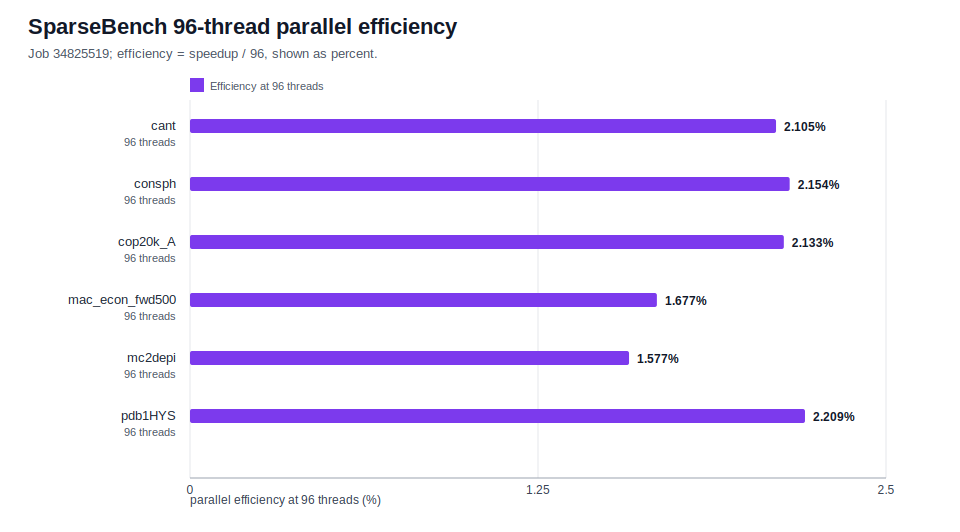

# SparseBench SpMV Baseline Report

This report records the completed SparseBench++ CSR SpMV evidence on Hyak. It is an engineering benchmark report, not a paper draft, and every performance statement below is scoped to the completed jobs listed here.

## Status Summary

The current reproducible benchmark evidence has two completed result sets:

- Job `34825519`: 96-core `cpu-g2-mem2x` SparseBench scaling over 6 SuiteSparse medium matrices and thread counts `1,2,4,8,16,32,64,96`.
- Job `34852262`: 32-core `cpu-g2` paired SparseBench versus Eigen baseline over the same 6 matrices and thread counts `1,2,4,8,16,32`.

The 192-core `cpu-g2-mem2x` probe, job `34851174`, is not result evidence. It remains `PENDING` with reason `QOSGrpCpuLimit`, and there are no 192-core CSVs, logs, package, or benchmark conclusions to report.

| Evidence | Partition / QOS | Commit printed by job | Validation status | Output evidence |
|---|---|---:|---|---|
| `34825519` SparseBench scaling | `cpu-g2-mem2x` / `stf-cpu-g2-mem2x`, 96 CPUs, 512G | `2fc974c0a4a0eea087f8e86dd5f54fe626992729` | `COMPLETED 0:0`, CTest `3/3`, empty stderr, 48 CSVs | `/gscratch/scrubbed/junyej/sparsebench/results/mem2x_34825519/` |
| `34852262` SparseBench vs Eigen | `cpu-g2` / `stf-cpu-g2`, 32 CPUs, 128G | `666d2568ed0a0976ac687cf5cd5b1721e73e17f0` | `COMPLETED 0:0`, CTest `5/5`, empty stderr, 72 CSVs | `/gscratch/scrubbed/junyej/sparsebench/results/eigen_baseline_34852262/` |
| `34851174` 192-core probe | `cpu-g2-mem2x`, 192 CPUs, 1500G | pending, not started | `PENDING`, reason `QOSGrpCpuLimit` | no completed result artifacts |

## Goal

SparseBench++ is being built as a reproducible CPU sparse-matrix benchmark harness for Hyak. The immediate goal is not to beat vendor libraries; it is to make a small, inspectable CSR SpMV implementation run through a disciplined path:

1. Parse real Matrix Market inputs.
2. Convert COO input to CSR.
3. Run serial and OpenMP CSR SpMV.
4. Emit stable CSV rows with timing and checksum fields.
5. Gate every Hyak batch job with CTest and manifest validation.
6. Preserve enough metadata for later reproduction.

## Implementation

The implemented benchmark path is intentionally narrow:

- Matrix Market parser: accepts `coordinate real general`, `coordinate integer general`, `coordinate pattern general`, and `coordinate real symmetric`.
- Conversion: converts 1-based Matrix Market coordinate input to 0-based CSR, including duplicate-coordinate accumulation through CSR SpMV behavior and symmetric off-diagonal expansion for supported real symmetric inputs.
- Kernels: provides serial CSR SpMV and OpenMP CSR SpMV when OpenMP is available.
- CLI: writes one CSV row per matrix/thread run with `matrix,nrows,ncols,nnz,threads,repeat,median_ms,min_ms,nnz_per_sec,checksum`.
- Tests: CTest covers parser formats, CLI CSV shape, and the optional Eigen CLI when `SPARSEBENCH_USE_EIGEN=ON`.
- Slurm templates: validate manifests before building, refuse fallback `diag5.mtx` for real benchmark runs, build on compute nodes, run CTest, then execute thread sweeps.

The Eigen baseline is optional. `SPARSEBENCH_USE_EIGEN` defaults to `OFF`; the default Eigen-free build was verified by one-off job `34852283`, which completed with CTest `3/3` and did not produce `sparsebench_spmv_eigen`.

## Dataset

Both completed benchmark jobs use the medium SuiteSparse manifest:

```text
/gscratch/scrubbed/junyej/sparsebench/data/medium_matrices.txt
```

The manifest contains 6 parser-supported matrices:

| Matrix | Rows | Cols | nnz |
|---|---:|---:|---:|
| `cant` | 62,451 | 62,451 | 4,007,383 |
| `consph` | 83,334 | 83,334 | 6,010,480 |
| `cop20k_A` | 121,192 | 121,192 | 2,624,331 |
| `mac_econ_fwd500` | 206,500 | 206,500 | 1,273,389 |
| `mc2depi` | 525,825 | 525,825 | 2,100,225 |
| `pdb1HYS` | 36,417 | 36,417 | 4,344,765 |

## Experiment 1: 96-Core SparseBench Scaling

Job `34825519` ran SparseBench CSR SpMV on `cpu-g2-mem2x` with 96 allocated CPUs, `repeat=30`, and thread counts `1,2,4,8,16,32,64,96`.

Validation facts:

- Slurm accounting: `COMPLETED 0:0`.
- Stdout contained CTest `3/3 tests passed`.
- Stderr was empty.
- CSV coverage was exactly `6 matrices x 8 thread counts = 48 files`.
- Every CSV had one data row, `repeat=30`, positive timing/rate fields, and finite checksum.
- Analysis files:
  - `/gscratch/scrubbed/junyej/sparsebench/analysis/mem2x_34825519_summary.csv`
  - `/gscratch/scrubbed/junyej/sparsebench/analysis/mem2x_34825519_summary.md`




| Matrix | t1 median ms | Best thread | Best median ms | Best speedup | Speedup at 96 | Efficiency at 96 |
|---|---:|---:|---:|---:|---:|---:|
| `cant` | 4.690330 | 64 | 2.312999 | 2.028x | 2.020x | 2.105% |
| `consph` | 7.104646 | 64 | 3.434521 | 2.069x | 2.068x | 2.154% |
| `cop20k_A` | 3.300247 | 64 | 1.608718 | 2.051x | 2.048x | 2.133% |
| `mac_econ_fwd500` | 1.589094 | 16 | 0.874141 | 1.818x | 1.610x | 1.677% |
| `mc2depi` | 2.689249 | 8 | 1.588047 | 1.693x | 1.514x | 1.577% |
| `pdb1HYS` | 5.307917 | 64 | 2.500040 | 2.123x | 2.121x | 2.209% |

Interpretation: this is valid benchmark signal for the current harness, but CSR SpMV is memory-bandwidth limited on these inputs. The best observed speedups range from `1.693x` to `2.123x`; all six matrices peak before 96 threads. That early peak is recorded as scaling behavior, not a job failure.

## Experiment 2: 32-Core SparseBench vs Eigen

Job `34852262` ran paired SparseBench and Eigen SpMV on `cpu-g2` with 32 allocated CPUs, `repeat=30`, and thread counts `1,2,4,8,16,32`.

Validation facts:

- Slurm accounting: `COMPLETED 0:0`.
- Stdout contained CTest `5/5 tests passed`.
- Stderr was empty.
- CSV coverage was exactly `6 matrices x 6 thread counts x 2 backends = 72 files`.
- SparseBench and Eigen checksums matched within the analyzer tolerance for every matrix/thread pair.
- Analysis files:
  - `/gscratch/scrubbed/junyej/sparsebench/analysis/eigen_baseline_34852262_summary.csv`
  - `/gscratch/scrubbed/junyej/sparsebench/analysis/eigen_baseline_34852262_summary.md`


In this run, Eigen won `36/36` paired matrix/thread median-time comparisons. This is a run-specific result on `cpu-g2`, not a universal claim about all machines or matrices.

| Matrix | Best SparseBench | Best Eigen | Eigen/SparseBench ratio range |
|---|---:|---:|---:|
| `cant` | t32, 1.7624685 ms | t16, 0.216264 ms | 0.118-0.581 |
| `consph` | t32, 2.633834 ms | t32, 0.4435015 ms | 0.162-0.584 |
| `cop20k_A` | t32, 1.278647 ms | t32, 0.132394 ms | 0.104-0.601 |
| `mac_econ_fwd500` | t16, 0.7333225 ms | t16, 0.1557395 ms | 0.212-0.504 |
| `mc2depi` | t32, 1.399454 ms | t16, 0.343136 ms | 0.244-0.584 |
| `pdb1HYS` | t32, 1.9029455 ms | t32, 0.2616335 ms | 0.137-0.604 |

The Eigen timing loop excludes Matrix Market parsing and CSR-to-Eigen conversion. SparseBench and Eigen therefore both time only repeated SpMV after input preparation.

## Reproducibility

Project and scratch conventions:

```bash
PROJECT_ROOT=/gscratch/stf/$USER/projects/SparseBench
RUNROOT=/gscratch/scrubbed/$USER/sparsebench
MATRIX_LIST=$RUNROOT/data/medium_matrices.txt
```

Module stack observed in job `34852262`:

```text
gcc/11.2.0
cmake/3.25.1
cesg/eigen/3.3.9
```

The `34825519` Slurm template loads `cmake/3.25.1`; its stdout showed a successful configure/build step and CTest run. For run facts, prefer the Slurm log, result CSVs, and accounting over the later package `environment.txt`, which records the packaging environment rather than the original compute-node environment.

Packaged `34825519` evidence:

```text
/gscratch/scrubbed/junyej/sparsebench/package_mem2x_34825519
/gscratch/scrubbed/junyej/sparsebench/sparsebench_mem2x_34825519.tar.gz
/gscratch/scrubbed/junyej/sparsebench/sparsebench_mem2x_34825519.sha256
sha256: de90447e85738344e2479ac9b8c7147b1090ab8562331b48465e7911736f9c59
```

Reproduce the 96-core SparseBench scaling shape:

```bash
cd /gscratch/stf/$USER/projects/SparseBench

MATRIX_LIST=/gscratch/scrubbed/$USER/sparsebench/data/medium_matrices.txt

bash -n slurm/spmv_mem2x_scaling.slurm
sbatch --test-only \
  --export=ALL,MATRIX_LIST="$MATRIX_LIST" \
  slurm/spmv_mem2x_scaling.slurm

sbatch \
  --export=ALL,MATRIX_LIST="$MATRIX_LIST" \
  slurm/spmv_mem2x_scaling.slurm
```

Reproduce the Eigen baseline workflow:

```bash
cd /gscratch/stf/$USER/projects/SparseBench

bash -n slurm/spmv_eigen_baseline_cpu_g2.slurm
sbatch --test-only slurm/spmv_eigen_baseline_cpu_g2.slurm
sbatch slurm/spmv_eigen_baseline_cpu_g2.slurm
```

Regenerate the Eigen analysis for a completed Eigen job:

```bash
python3 scripts/analyze_spmv_baseline.py \
  /gscratch/scrubbed/$USER/sparsebench/results/eigen_baseline_<jobid> \
  --out-dir /gscratch/scrubbed/$USER/sparsebench/analysis \
  --run-id <jobid> \
  --expected-repeat 30 \
  --expected-file-count 72
```

Regenerate the report SVG assets from the committed helper script:

```bash
python3 scripts/generate_report_assets.py \
  --mem2x-summary /gscratch/scrubbed/$USER/sparsebench/analysis/mem2x_34825519_summary.csv \
  --eigen-summary /gscratch/scrubbed/$USER/sparsebench/analysis/eigen_baseline_34852262_summary.csv \
  --out-dir docs/reports/assets
```

Raw benchmark CSVs remain generated artifacts and are not committed. The committed report assets are small deterministic SVGs derived from the summary CSVs.

## Limitations

- SparseBench++ currently measures CSR SpMV only.
- The benchmark scope is CPU-only and OpenMP-only.
- The current external baseline is Eigen only; SuiteSparse, SciPy, MKL, and other baselines are future work.
- The current 96-core scaling results do not include a completed 192-core run.
- The tested matrices are useful medium SuiteSparse cases, but they are not a full sparse-matrix benchmark suite.
- The implementation prioritizes traceability and correctness gates over low-level optimization.
- SpMV is memory-bandwidth limited, so adding threads does not imply linear speedup.

## Next Work

1. Preserve or mirror the `34852262` Eigen baseline evidence if `/gscratch/scrubbed` cleanup becomes likely.
2. Keep tracking job `34851174`; only use it if it completes and produces the expected 60 CSVs with clean logs.
3. Add additional external baselines after the Eigen path is stable.
4. Expand beyond SpMV only after the reporting and artifact workflow remains reproducible.
5. Add CG or Lanczos later, using the same manifest, Slurm, CTest, and reporting discipline.
